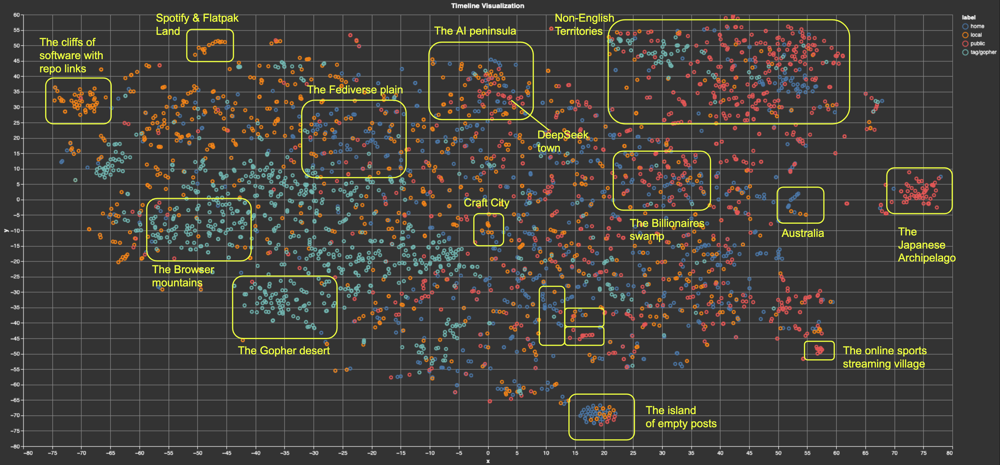

  <picture>
    <!-- When the user prefers dark mode, show the white logo -->
    <source media="(prefers-color-scheme: dark)" srcset="./images/Blueprint-logo-white.png">
    <!-- When the user prefers light mode, show the black logo -->
    <source media="(prefers-color-scheme: light)" srcset="./images/Blueprint-logo-black.png">
    <!-- Fallback: default to the black logo -->
    
  </picture>

# Build Your Own Timeline Algorithm

👉 MEANS Work In Progress

Timeline algorithms should be useful for people, not for companies. Their quality should not be evaluated in terms of how much more time people spend on a platform, but rather in terms of how well they serve their users’ purposes. Objectives might differ, from delving deeper into a topic to connecting with like-minded communities, solving a problem or just passing time until the bus arrives. How these objectives are reached might differ too, e.g. while respecting instances’ bandwidth, one’s own as well as others’ privacy, algorithm trustworthiness and software licenses.

This blueprint introduces an approach to personal, local timeline algorithms that people can either run out-of-the-box or customize.

*A 2D map of multiple timelines created with BYOTA (labels have been manually added).*

📘 To explore this project further and discover other Blueprints, visit the [**Blueprints Hub**](https://developer-hub.mozilla.ai/).

 📖 For more detailed guidance on using this project, please visit our [**Docs here**](https://mozilla-ai.github.io/BYOTA/)

## Built with
- 
- [Mastodon.py](https://github.com/halcy/Mastodon.py)
- [Llamafile](https://github.com/Mozilla-Ocho/llamafile)
- [Marimo](https://github.com/marimo-team/marimo)

## See it in action

- [Talk @ FOSDEM 2025](https://video.fosdem.org/2025/ud2208/fosdem-2025-5601-build-your-own-timeline-algorithm.mp4)

- 👉 DEMO (Coming soon)

## Quick-start

👉 Instructions for the BYOTA docker demo:
- locally with Docker
- on HF

## How it Works
BYOTA relies on a stack which makes use of [Mastodon.py](https://github.com/halcy/Mastodon.py) to get recent timeline data, [llamafile](https://github.com/Mozilla-Ocho/llamafile) to calculate post embeddings locally, and [marimo](https://github.com/marimo-team/marimo) to provide a UI that runs in one’s own browser. Using this stack, you can visualize, search, and re-rank posts from the fediverse without any of them leaving your computer.

## Pre-requisites

- **System requirements**:
  - OS: Windows, macOS, or Linux
  - Python 3.11 or higher
  - 👉 Minimum RAM: 1GB (double check)
  - Disk space: 1.3GB for the Docker image, or ~1GB for local installation (~800MB for code + deps, plus the embedding model of your choice). If you want to compile llamafile yourself, you'll need ~5GB extra (NOTE: the Docker image already contains it)

- **Dependencies**:
  - Dependencies listed in `pyproject.toml`

## Troubleshooting

The code is still experimental and will be subject to breaking updates in the next few weeks. Please be patient, raise issues, and check often for the latest updates! 🙇

## License

This project is licensed under the Apache 2.0 License. See the [LICENSE](LICENSE) file for details.

## Contributing

Contributions are welcome! To get started, you can check out the [CONTRIBUTING.md](CONTRIBUTING.md) file.
