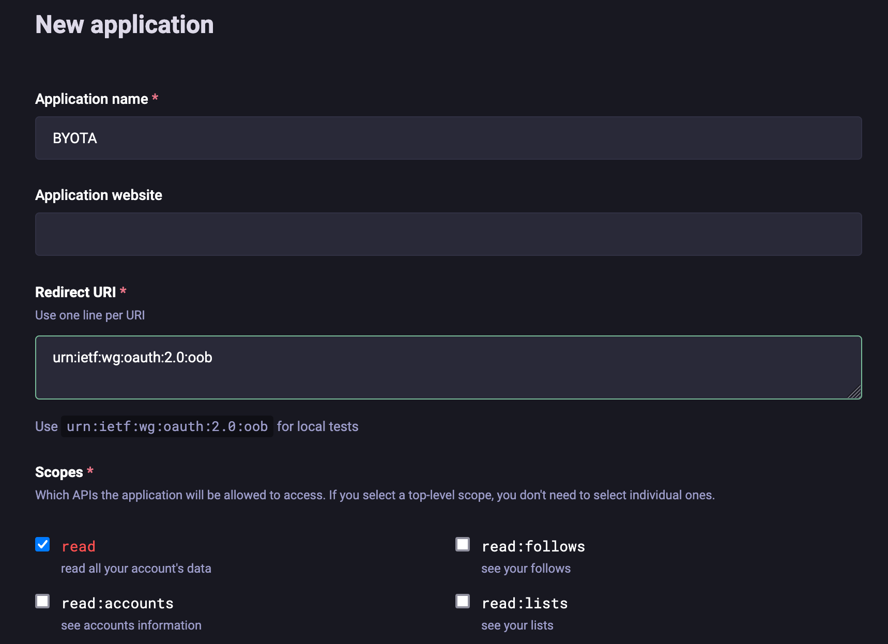

# Getting Started With BYOTA

You can run BYOTA in a few different ways: 

- as a demo, showcasing its features on synthetic data
- as a self-contained Docker image running on your computer
- as a set of applications you manually deploy on your system

These options are sorted by difficulty (the simplest one start with a single click!) but also by amount of control you have on the whole system. The following sections will explain these options in detail, so you can find the one that works best for you.

## BYOTA demo (running on synthetic data)

The BYOTA demo is a [marimo](https://marimo.io/) application that allows you to experiment with BYOTA's features using synthetic data. You can run it in one of the following ways:

- one-click access to HuggingFace spaces:
  - [](https://huggingface.co/spaces/mozilla-ai/byota)  (👉 make sure link is ok)
- locally with Docker:
  1. `docker run -it -p 8080:8080 -p 2718:2718 mzdotai/byota demo.py`
  1. open a browser and connect to http://localhost:2718


## BYOTA (running on real data)

The BYOTA application runs on real data, i.e. data downloaded from your Mastodon account. For this to work, you first need to generate some credentials for the application, then run BYOTA either as a Docker container or as a set of applications deployed in your system.

### Generating Mastodon credentials

1. Connect to https://<your_mastodon_instance>/settings/applications (log in if needed)
1. Click on the `New application` button
1. Enter a name for your application (e.g. `BYOTA`)
1. Leave the Redirect URI as it is (`urn:ietf:wg:oauth:2.0:oob`)
1. In the `Scopes` section, check the `Read` checkbox (you can uncheck `Profile` if you want)
1. Click the `Submit` button at the end of the page



After this, your new application will appear in the applications page. If you click on its name, you will be able to see the application credentials including its client key, client secret, and access token. 

The two pieces of information you will need to pass BYOTA to access your account are this token (which we will refer to as `MASTODON_ACCESS_TOKEN` from now on) and the API base URL of your Mastodon instance (which in most cases is the instance URL itself, and we call `MASTODON_API_BASE_URL`).

### Running BYOTA as a Docker container

Now that you have a registered application and its access token, you can run BYOTA's Docker container as follows:

```
docker run -it -p 8080:8080 -p 2718:2718 -e MASTODON_ACCESS_TOKEN="<your_access_token>" -e MASTODON_API_BASE_URL="<your_api_base_url>" mzdotai/byota
```

Once the container is up and running, you can open the marimo notebook (which is started by default in [app view](https://docs.marimo.io/guides/apps/)) by connecting to http://localhost:2718. You will be asked a password which is, by default, `byota` (you can customize it in the `entrypoint.sh` file when you build your own image).

> **NOTE**
>
> If for any reason you don't want to directly pass your credentials on the command line, you can also run the docker container as follows:
>
>```
>docker run -it -p 8080:8080 -p 2718:2718 mzdotai/byota
>```
>
>... and provide the credentials in a json file called `auth.json`, formatted like follows:
>
>```
>{
>  "MASTODON_ACCESS_TOKEN": "<your_access_token>",
>  "MASTODON_API_BASE_URL": "<your_api_base_url>"
>}
>```


### Running BYOTA into your system

This choice allows you to have the maximum level of customization, i.e. you can edit the notebook code, choose your own embedding server and model, and so on.

To run BYOTA into your system, you first need to start a local embedding server. Then, you can run the marimo notebook in edit mode. 

#### Running a local embedding server

BYOTA relies on *sentence embeddings* to internally represent statuses from your Mastodon timeline. You can think about them as numerical descriptors of Mastodon statuses that are closer the more semantically similar two statuses are.

BYOTA supports both [llamafile](https://github.com/Mozilla-Ocho/llamafile) and [ollama](https://ollama.com/) as embedding servers:

- to install a llamafile embedding server, follow the instructions you find
  [here](https://github.com/Mozilla-Ocho/llamafile/blob/main/llamafile/server/doc/getting_started.md):
  the `all-MiniLM-L6-v2` model cited there works perfectly with the current version of BYOTA, but you can also try others you can find in the *Text Embedding Models* section [here](https://github.com/Mozilla-Ocho/llamafile/).

- to install ollama and the `all-MiniLM` model, first download the executable for your OS from [here](https://ollama.com/),
  then install the model with the command `ollama pull all-minilm`. If you are curious to try more models,
  you can check the list of embedding models available [here](https://ollama.com/search?c=embedding).

>**NOTE**
>
>The default embedding server URL provided in the configuration form is `http://localhost:8080/embedding` which is llamafile's default.
>If you have chosen to use ollama instead, at the moment you need to manually provide its default URL which is `http://localhost:11434/api/embed`.

#### Running the marimo notebook in edit mode

- Set up and activate your favorite python env
- run `pip install -r requirements`
- run `marimo edit notebook.py`
- a browser window will open with the notebooks

>**NOTE**
>
>Remember to make sure your `MASTODON_ACCESS_TOKEN` and `MASTODON_API_BASE_URL` are accessible, either by setting them in your env or by creating an `auth.json` file in the same directory where the notebook runs.
