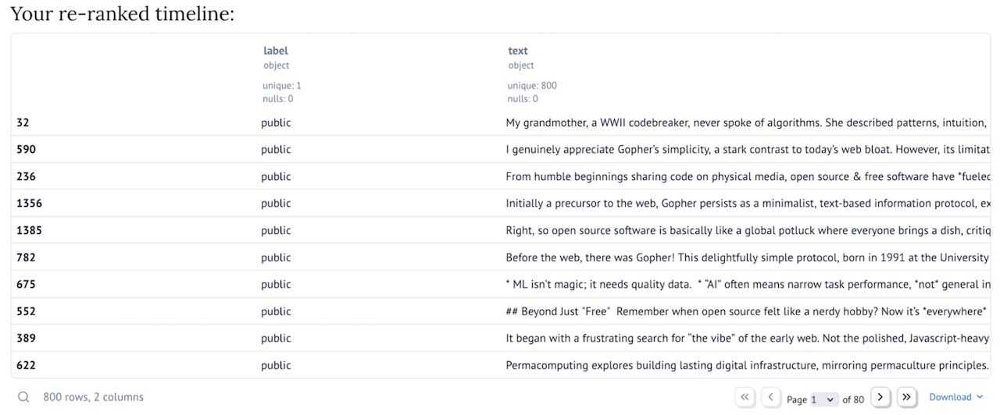

# **Step-by-Step Guide: How this Blueprint Works**

## BYOTA is running... Now what?

### Configuration

The Configuration section allows you to choose which timeline(s) you want to download, the embeddings server API you want to use (see details [here](https://mozilla-ai.github.io/byota/getting-started/#step-1-running-a-local-embedding-server)), and whether to run in offline mode (in this case statuses won't be downloaded, but read from a file where you have previously saved them).

After you click on the submit button, posts from the timelines will be downloaded and their embeddings calculated.

### Embeddings Visualization

In this section, you can see posts from different timelines represented as points on a plane: you can click on a timeline label on the top right to highlight only posts from that timeline. If you select one or more points, you will see them in the table below the plot. By clicking on the column names (e.g. label, text) you can sort them, wrap text (to see full post contents), or search their content.

### Timeline search

Here you can search for the most similar posts to a given one. You can either provide a row id (the leftmost column in the previous table) to refer to an existing post, or freeform text to look for posts which are similar in content to what you wrote.

![A form with a text saying "Enter a status id or some free-form text to find the most similar statuses". The content of the text box below that is "I like everything open source, free software, and digital rights". Below that, six posts are shown in a three-column table: on the left some IDs, in the center a column titled "label" shows values such as "public", "local", and on the right a column called "text" show the content of some statuses, containing text such as "Digital tools shape modern life", "Open source isn't just about free software", and "Initially skeptical, I discovered open source isn't free as in cheap, but free as in freedom".](images/search.png)

### Timeline re-ranking

A score is assigned to each post in the timeline, with higher scores given to posts that are more similar to a set of other posts (in the specific case of the demo, statuses I shared from my personal Mastodon account). This score is then used to re-rank a timeline of your choice to prioritize those topics which are more present in the reference set.

### Re-rank your own posts

Depending on the timeline you are considering, it might be more or less hard to understand how well the re-ranking worked. To give you a better sense of the effect of re-ranking, this section re-ranks an individual’s set of posts, according to a topic identified by some well-known tag.

## 🎨 **Customizing the Blueprint**

To better understand how you can tailor this Blueprint to suit your specific needs, please visit the **[Customization Guide](customization.md)**.

## 🤝 **Contributing to the Blueprint**

Want to help improve or extend this Blueprint? Check out the **[Future Features & Contributions Guide](future-features-contributions.md)** to see how you can contribute your ideas, code, or feedback to make this Blueprint even better!
