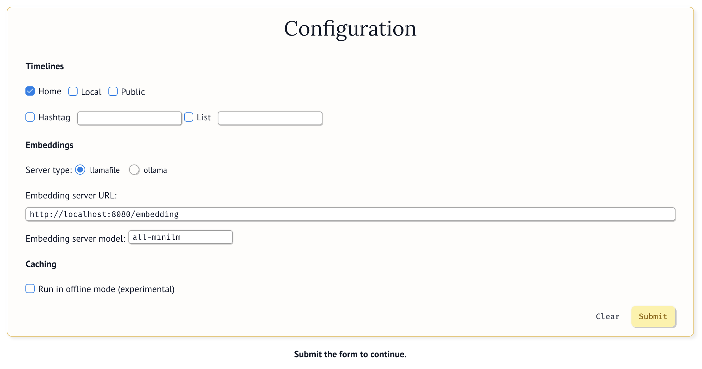

# **Step-by-Step Guide: How this Blueprint Works**

---

## **Overview**

- BYOTA components and architecture
- explain it is more like a playground for local algorithms, but allows to easily share the tool with ppl who are not developers
- a few more words about alternative deployments

---

## BYOTA is running... Now what?

The Configuration section allows you to choose which timeline(s) you want to download, the embeddings server API you want to use (see details in the previous section), and whether to run in offline mode (in this case statuses won't be downloaded, but read from a file where you have previously saved them).

## 🎨 **Customizing the Blueprint**

To better understand how you can tailor this Blueprint to suit your specific needs, please visit the **[Customization Guide](customization.md)**.

## 🤝 **Contributing to the Blueprint**

Want to help improve or extend this Blueprint? Check out the **[Future Features & Contributions Guide](future-features-contributions.md)** to see how you can contribute your ideas, code, or feedback to make this Blueprint even better!
